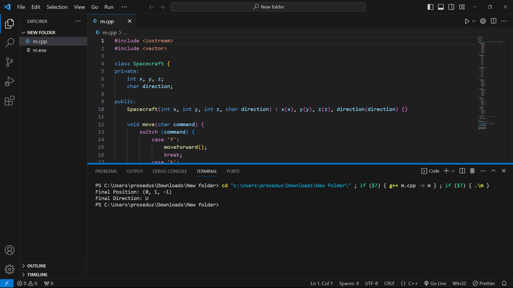

# Chandrayaan_3_TDD
Problem Statement Chandrayaan 3 Lunar Craft: Galactic Space Craft Control

# Screenshots

# Problem Statement

Chandrayaan 3 Lunar Craft: Galactic Space Craft Control

## Description

As a scientist at ISRO controlling the latest lunar spacecraft Chandrayaan 3, your task is to develop a program that translates commands sent from Earth into instructions understood by the spacecraft. The spacecraft navigates through the galaxy using galactic coordinates, represented by x, y, z coordinates (x for east or west location, y for north or south location, and z for distance above or below the galactic plane).

## Requirements

You will be given the initial starting point (x, y, z) of the spacecraft and the direction it is facing (N, S, E, W, Up, Down). The spacecraft receives a character array of commands, and you are required to implement the following functionalities:

<ol>
<li>
<b>Move</b> the spacecraft forward/backward (f, b): The spacecraft moves one step forward or backward based on its current direction.
</li>
<li>
<b>Turn</b> the spacecraft left/right (l, r): The spacecraft rotates 90 degrees to the left or right, changing its facing direction.
</li>
<li>
<b>Turn</b> the spacecraft up/down (u, d): The spacecraft changes its angle, rotating upwards or downwards.
</li>
</ol>

## Example

Given the starting point (0, 0, 0) following (x, y, z) and initial direction N, the following commands should result in the indicated final position and direction:

<b>Commands</b>: [“f”, “r”, “u”, “b”, “l”]

<b>Starting Position</b>: (0, 0, 0)

<b>Initial Direction</b>: N

“f” - (0, 1, 0) - N
“r” - (0, 1, 0) - E
“u” - (0, 1, 0) - U
“b” - (0, 1, -1) - U
“l” - (0, 1, -1) - N

<b>Final Position</b>: (0, 1, -1)

<b>Final Direction</b>: N

Your task is to design the program that enables Chandrayaan 3 to execute these commands accurately and efficiently in the vast expanse of the galaxy:

<ul>
<li>
Make sure to take an incremental approach and show it in the commits
</li>
<li>
Keep your code clean, readable, and modularized
</li>
<li>
Do not throw exceptions/handle cases for invalid arguments
</li>
</ul>
